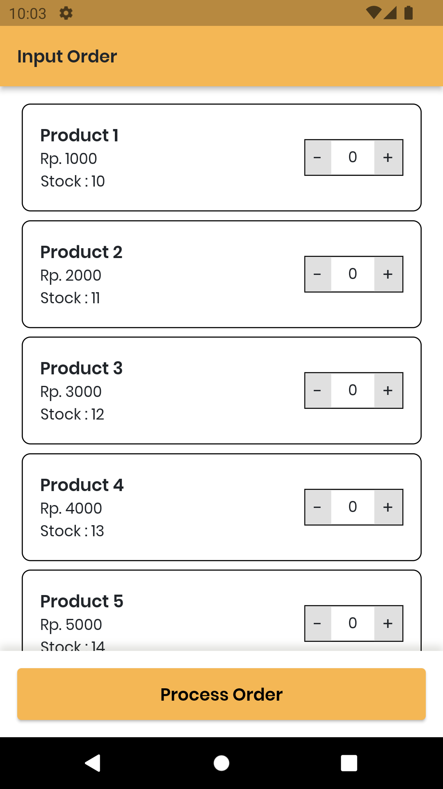
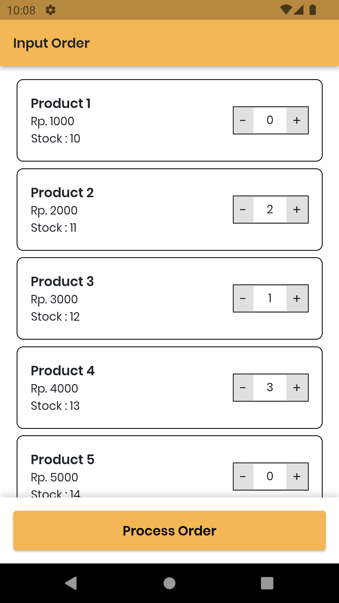
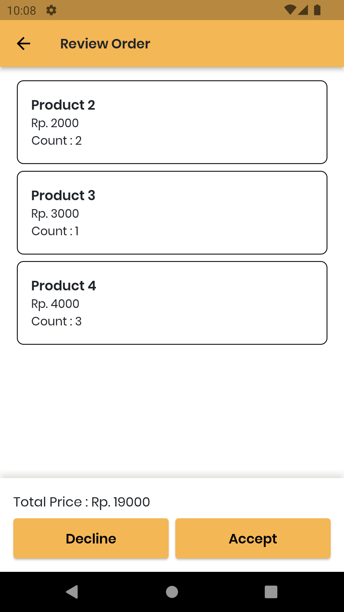
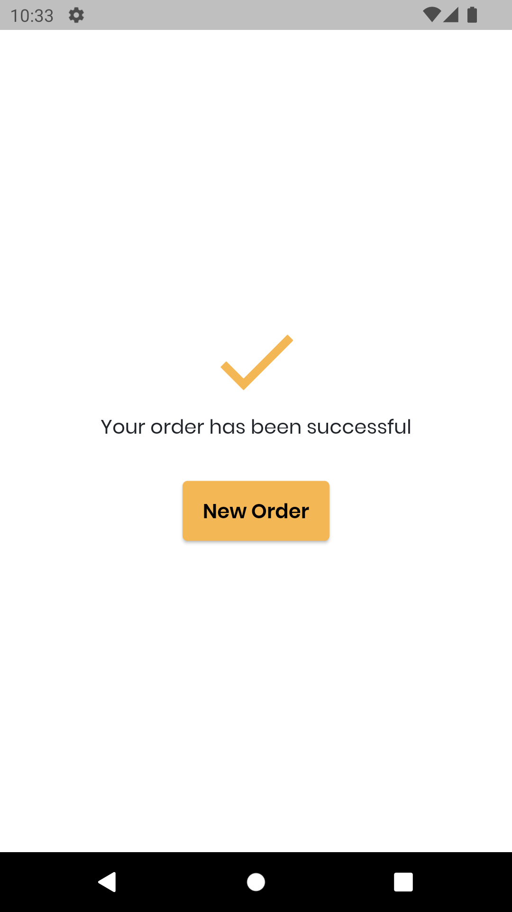

# Order App

Order App is a flutter app that will help you to order some product.

I developed this application as a registration exam in a company.

## Additional Information

This project implements :

- BLoC (State Management)
- Repository Pattern
- Dependency Injection
- Theme Configuration
- Automatic testing

## How to Use

1. The application will display several products that you can choose.

2. You can click the plus button on each item if you want to choose that product. Then click the "Process Order" when you are finished selecting the product.

3. The application will display the product you have selected. If you want to change the product that has been selected, please click the "decline" button. If you are sure of the choice, click the "accept" button.

4. Your order has been successfully processed. If you want to make a new order, please click the "New Order" button.

